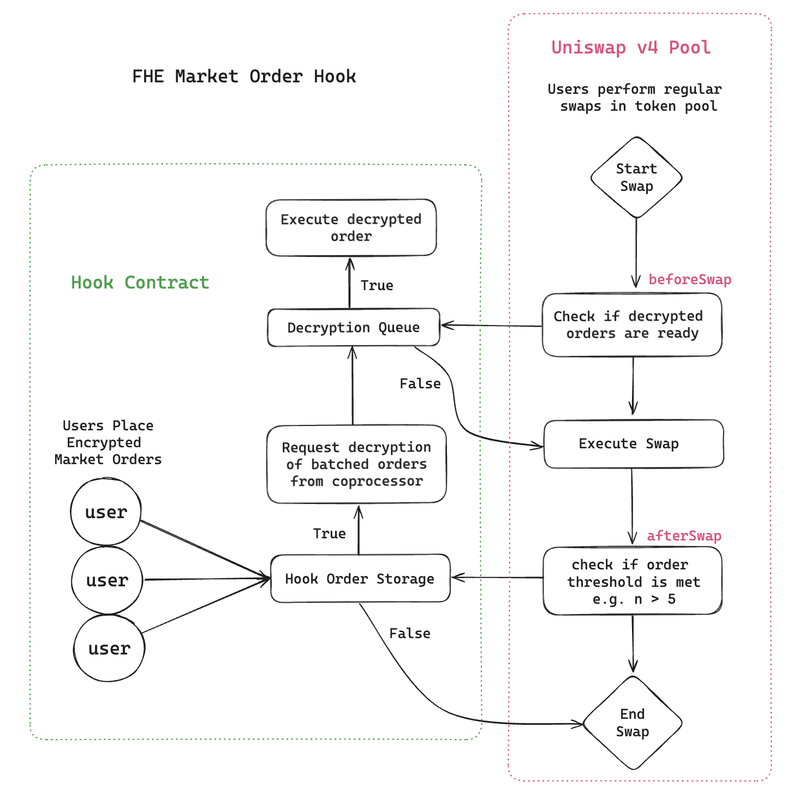

## 📈 Encrypted Market Order Hook

**A privacy-preserving smart contract extension that enables encrypted market orders on Uniswap v4 using Fully Homomorphic Encryption (FHE).**

In traditional DeFi, every action—especially trading—is public. This hook proposes a new model: **users can place market orders without revealing their strategy**, using encrypted logic that executes as soon as the right conditions are met. 

By combining Uniswap v4’s new **hook architecture** with an **FHE coprocessor** (e.g. [Fhenix](https://www.fhenix.io/)), this system lets encrypted orders:
- Stay hidden until market conditions warrant decryption.
- Be executed automatically during normal Uniswap swaps.
- Operate without disrupting existing liquidity or user flows.

## 🔄 Encrypted Market Order Flow

This system enables private (encrypted) market orders to be automatically processed during regular Uniswap activity, using a smart contract hook and an FHE coprocessor.

### 1. 🔐 Users Place Private Orders  
Users send **encrypted market orders** to a smart contract known as the **hook contract**. These orders are stored privately and are not visible to the public.

### 2. 💱 Regular Swaps Occur  
While private orders sit encrypted, other users continue to use the Uniswap pool as normal, performing swaps publicly.

### 3. ⚙️ Hook Triggers on Every Swap  
Each time a swap occurs, Uniswap v4 calls two functions in the hook:
- `beforeSwap()` — runs **before** the swap
- `afterSwap()` — runs **after** the swap

### 4. 🔍 Executable Order Check (`beforeSwap`)  
The hook checks whether any previously decrypted orders are ready for execution:
- ✅ **Yes** → Execute them
- ❌ **No** → Skip

### 5. 🧠 Decryption Condition Check (`afterSwap`)  
Post-swap, the hook evaluates market data to see if any existing encrypted orders should now be **decrypted**:
- ✅ **Yes** → Trigger decryption request via the FHE coprocessor
- ❌ **No** → Orders remain encrypted

### 6. ✅ Finalize Swap  
The public swap completes, and any decrypted orders that were executed are now reflected on-chain.

### 7. 🔁 Repeat  
Each future swap re-triggers the process, keeping the system responsive and privacy-preserving in real time.

## ✅ Benefits of FHE Market Order Hooks

### 🔒 Trade Privacy
- Orders remain encrypted until execution.
- Prevents **front-running**, **sandwich attacks**, and **strategy leakage**.
- Traders can submit large or sensitive orders without broadcasting intent.

### 🧠 Encrypted Conditional Logic
- Execution conditions (e.g., price thresholds) are evaluated inside an **FHE coprocessor**.
- Orders are **only decrypted and executed** when the condition is met — in private.

### 🔁 Automated Reactivity
- Each swap triggers `beforeSwap()` and `afterSwap()` checks.
- Decrypted orders are auto-executed.
- Hook re-evaluates encrypted orders dynamically as swaps occur.

### 📦 Composable Privacy Layer
- Adds a **modular, privacy-preserving order flow** to any AMM.
- Can be combined with other Uniswap v4 hooks (e.g., fees, access control) without conflict.

## ⚠️ Pitfalls & Limitations

### ⏱️ Latency in Decryption
- FHE decryption introduces an **asynchronous delay** between decryption request and the decrrypted value being available on-chain.
- Depends on the **availability and liveness** of the coprocessor.

### ⛽ Increased Gas Usage
- FHE computations add overhead to each swap.
- Gas cost increases with:
    - Number of encrypted orders to evaluate.
    - Complexity of conditional checks.

### 🕵️‍♂️ Metadata Leakage
- Some metadata is still public:
  - When orders are submitted.
  - When orders are decrypted and executed.
- Privacy can be improved with **order batching** and **delta bundling**.

## 📦 Summary

This hook enables **non-custodial, private market order flow** within public AMMs.  

Encrypted orders:
- Are invisible until decryption is justified
- React dynamically to public liquidity changes  
- Avoid disrupting normal Uniswap functionality  
- Preserve privacy **without sacrificing composability**
