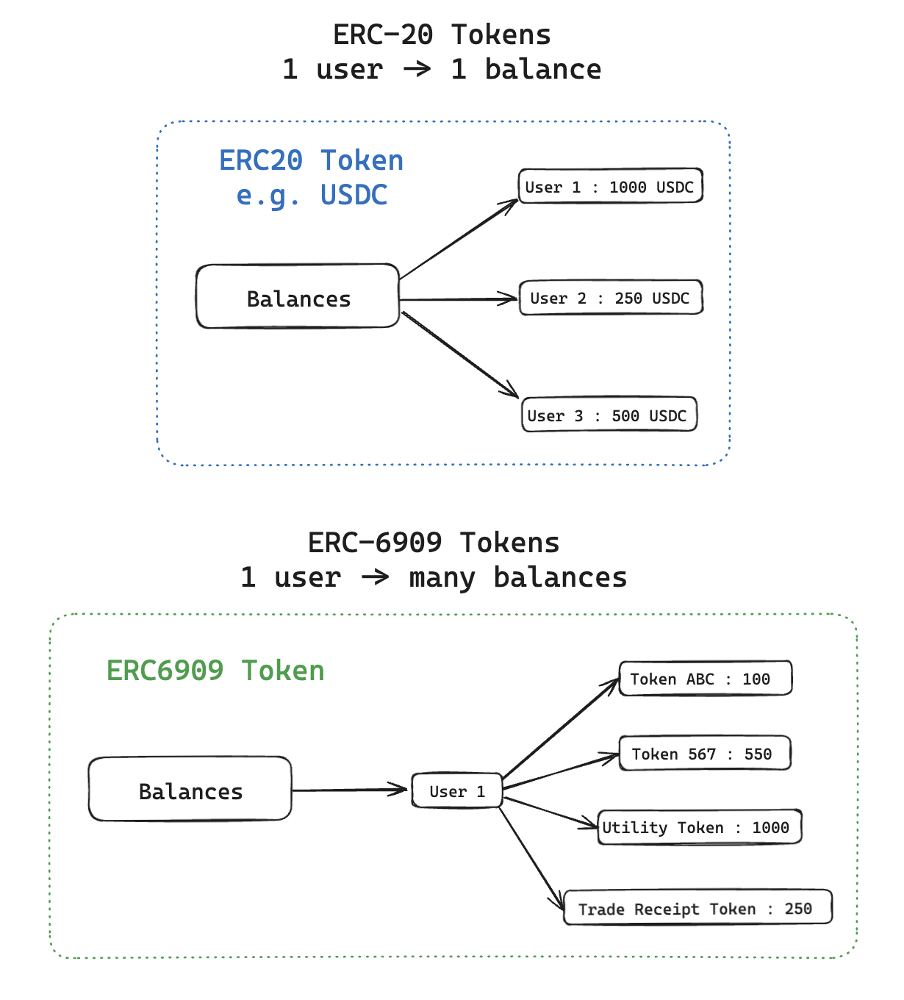
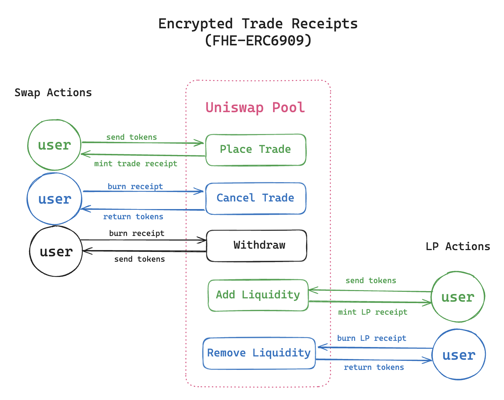

## 🧾 Encrypted Trade Receipts with ERC-6909 + FHE

This document explores the use of **ERC-6909**, a minimal, gas-efficient, and extensible multi-token standard, to represent **encrypted trade receipts** and **LP receipts**, enhanced with **Fully Homomorphic Encryption (FHE)** for privacy.

### 🆚 ERC-6909 vs ERC-20

| Feature                         | ERC-20                      | ERC-6909                               |
|----------------------------------|------------------------------|-----------------------------------------|
| Token type                      | Single fungible token       | Multi-token (fungible & non-fungible)   |
| Standard footprint              | Verbose                     | Minimal, gas-optimized                   |
| Token ID support           | Not applicable              | Supports multiple token IDs              |
| Native support for metadata     | Limited                     | Built-in extensibility                   |
| Use in complex dApps            | Rigid                       | Flexible (ideal for derivatives, receipts)  

> ERC-6909 is designed to act as a flexible ledger for many token types under a single contract, making it ideal for composable systems like AMMs, order books, and synthetic assets.

### 🔐 Why Encrypted ERC-6909?

By integrating **FHE** with ERC-6909 tokens, we can create **privacy-preserving on-chain receipts** that:
- Represent trades or LP shares
- Are non-revealing (e.g. amount, position, token type are encrypted)
- Enable trustless auditability via homomorphic computation

This design has major advantages over public ERC-20 or ERC-1155 receipts, which leak information about:
- Trader position size
- LP inflow/outflow timing
- Strategy signatures (e.g. recurring ratios or patterns)

---

### 🧩 Use Cases

- **Encrypted Trade Receipts**: Minted on every private swap. Only the user (or designated verifier) can decrypt the amount or asset info.
- **Encrypted LP Shares**: LPs receive ERC-6909 tokens whose balances are homomorphically encrypted, obscuring how much liquidity they’ve contributed.
- **Composability with FHE Coprocessor**: Allows DeFi dApps with sufficient permission to query encrypted receipt balances and perform logic **without decrypting** them.

### FHE-ERC6909 Tokens as Encrypted Trade Receipts

### 🛠️ Integration with FHE Coprocessor

Encrypted ERC-6909 balances can be:
- **Updated via FHE arithmetic** on deposit/withdraw
- **Queried privately** by users or permissioned contracts
- **Used in zero-knowledge workflows** (e.g. "prove I own more than X")

This architecture is highly modular and can serve as a **private accounting layer** for:
- AMMs  
- Lending protocols  
- Derivatives platforms  
- Order book-based DEXs

---

## 🔄 Summary

> ERC-6909 provides a multi-token abstraction layer.  
> FHE provides encrypted, on-chain logic and balances.  
> Together, they enable a new paradigm: **Private, programmable receipts** — modular, verifiable, and fully shielded.
