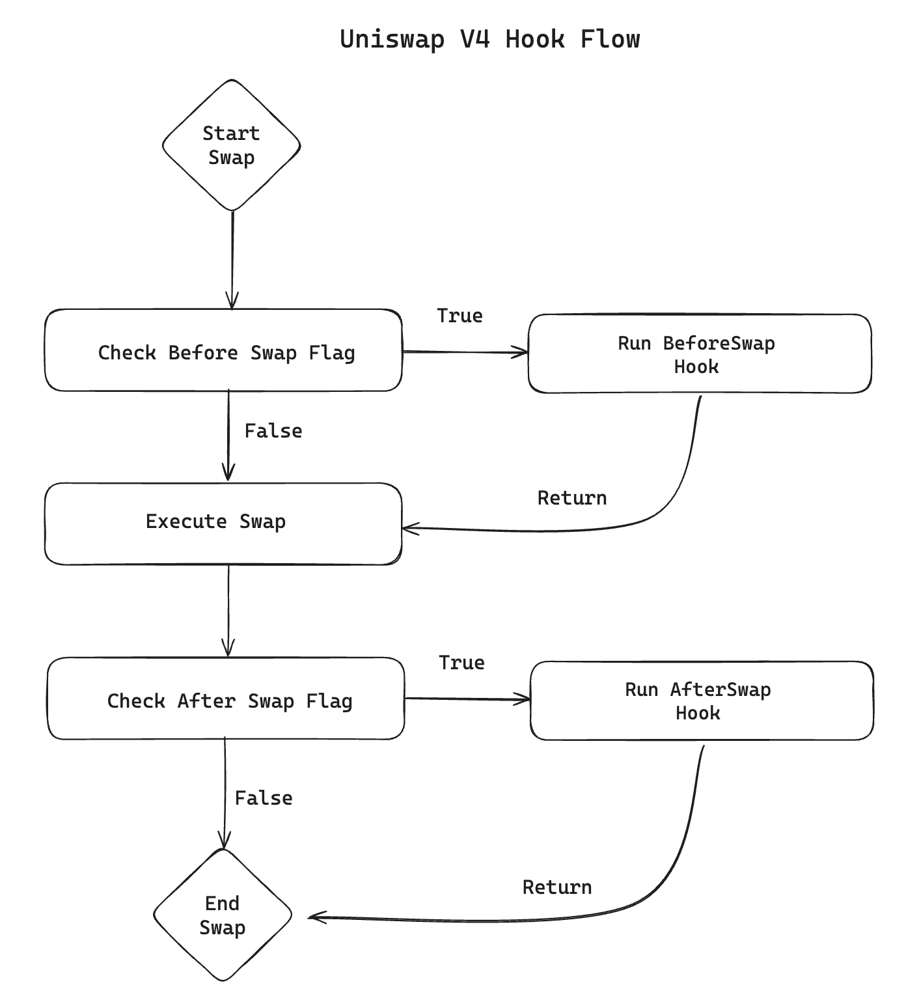

# 🔐 Experimental FHE Hooks for Privacy-Preserving DeFi

**Exploring the intersection of Fully Homomorphic Encryption (FHE) and Decentralized Finance (DeFi)**

> This repository is dedicated to research and experimentation at the frontier of crypto privacy: applying FHE to DeFi protocols such as Uniswap v4 through customizable hooks.

## 🧪 Abstract

This project explores how **Fully Homomorphic Encryption (FHE)** can be applied to 
**Decentralized Finance (DeFi)** to enable truly private on-chain interactions.

By integrating FHE with **Uniswap v4’s hook architecture**, we introduce a system 
where users can submit **encrypted market orders** without revealing intent or strategy.

Hooks trigger private computations within a secure coprocessor (e.g., Fhenix), enabling order execution only when encrypted conditions are met.

This approach preserves **composability** and **permissionless access**, while offering 
**meaningful privacy for traders** in public AMM environments.

## 🦄 High-Level Overview: How Swaps Work & Uniswap v4 Features

At its core, a **swap** is a simple trade between two tokens. In decentralized exchanges like Uniswap, this happens using **automated market makers (AMMs)**, which replace traditional order books with mathematical formulas to determine prices based on token reserves.

### 🔄 Basic Swap Flow

1. A user sends token A to a liquidity pool.
2. The pool returns token B, based on the current exchange rate.
3. The swap affects the pool’s token ratios, updating prices for the next trade.

### 🧱 Enter Uniswap v4: Hooks & Custom Logic

Uniswap v4 introduces **hooks**, a powerful new upgrade that allows developers to run custom smart contract logic at specific points in the swap lifecycle:

- `{before,after}Initialize`
- `{before,after}AddLiquidity`
- `{before,after}RemoveLiquidity`
- `{before,after}Swap`
- `{before,after}Donate`

These hooks turn Uniswap into a **programmable liquidity layer**, enabling use cases like:
- On-chain limit orders
- Dynamic fees
- KYC or access control
- Strategy execution
- 🕵️ And in our case: **encrypted, privacy-preserving order flow using FHE**

### v4 Hook Flow Example

This diagram illustrates how Uniswap v4 hooks (`beforeSwap`, `afterSwap`) fit into the swap lifecycle.

